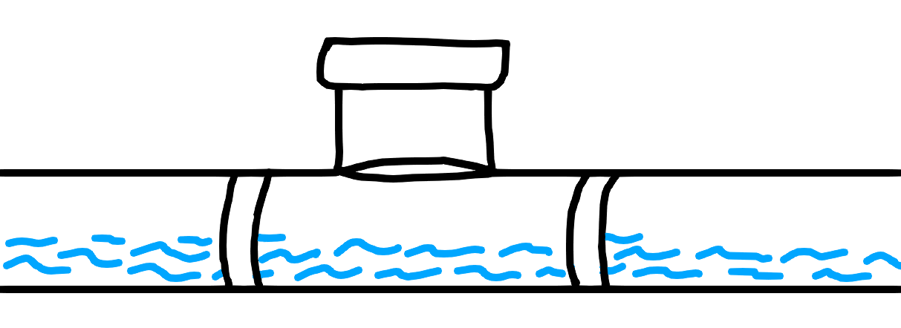

# Design

## 1. Intended purpose 

### 1.1 Situation

To ensure the safe transportation of water within the PVC system, we aim to
measure the water's flow rate. The motor should remain inactive when no water
is passing through the pipe, and it should activate when water flows through
the system. There are multiple ways to achieve these requirements, the most
viable options are:

**Traditional flow meter**:  

- (+) Has multiple states. 
- (-) Blocks the flow of the water. 
- (-) Can cause leaks. 

**Ultrasonic flow meter**:  

- (+) Accurate and supports multiple states. 
- (-) Hard to implement and seal. 

**Paddle Flow Switch**:  

- (+) Simple to implement. 
- (+) No calculations needed. 
- (+) Has two states. 
- (-) Magnetic sensors are either weak or inaccurate.

For this project, we opted for the paddle flow switch solution due to its
simplicity of implementation and its ability to meet all the specified
requirements. Additionally, this solution effectively resolves the issue of
water blockage.

### 1.2 State 

## 2. Design specifictations
- **Three-way connector (PVC)**: Connect the paddle flow switch to the system.

- **Partial Valve**: The valve must remain non-blocking, enabling the water to
seamlessly trigger the magnetic switch while causing minimal interference with
the flow rate.

    - **Magnet holder**: Is installed on the partial valve, which is pushed
    towards the magnetic switch.

- **Water-tight seal**: The design should guarantee a water-tight seal to effectively prevent any water leakage or disruption to the flow rate.

- **Magnetic switch / Hall effect sensor**: A sensor that can detect the change
of an electro magnetic field.

- **Can-bus system**: For transporting the current state of the magnetic switch.

## 3. Design tools
The tools/products used for sketching, creating and exporting are;

- [Autodesk Fusion 360](https://www.autodesk.eu/products/fusion-360)
- [Ultimaker Cura](https://ultimaker.com/software/ultimaker-cura)
- [Creality Ender-5 Pro](https://www.creality.com/goods-detail/ender-5-pro-3d-printer)

### 3.1 Tool configurations
The following configurations are reconstruction purposes, but they are tuned for the [Creality Ender-5 Pro](https://www.creality.com/goods-detail/ender-5-pro-3d-printer) printer.
While using this 3D-printer is not required, these configurations may vary on
different 3D-printers. The following settings are used:

- **Filament:** PLA
- **Temperature:** 210 C
- **Speed:** 80mm/s
- **Support:** no

**Advanced Settings**

- **Layer height:** 0.2mm
- **Infill:** 20.0%
- **Nozzle:** 0.4mm

## 4. Prototyping

*Currently in use*.

### 4.1 Physical

#### 4.1.1 Prototype 1

#### 4.1.2 Prototype 3

#### 4.1.3 Prototype 3

### 4.2 Revisions
- **The first prototype** was created with the hinge on top, so that the entire valve
  could be round. This ment that the turning point of the valve was slightly more in
  the back. The challenge in 3D printing this prototype stemmed from its curvature.

- **The second prototype** removed a part of the valve and replaced it with the hinge.
  This made printing the prototype more robuust and reliable.However, the hinge walls
  proved to be too susceptible and this was fixed in the **third prototype** 